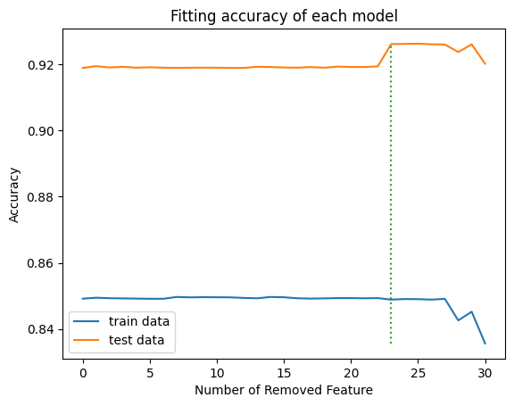
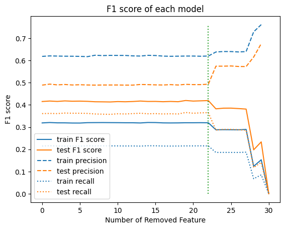
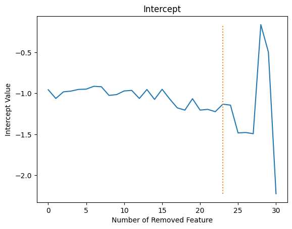
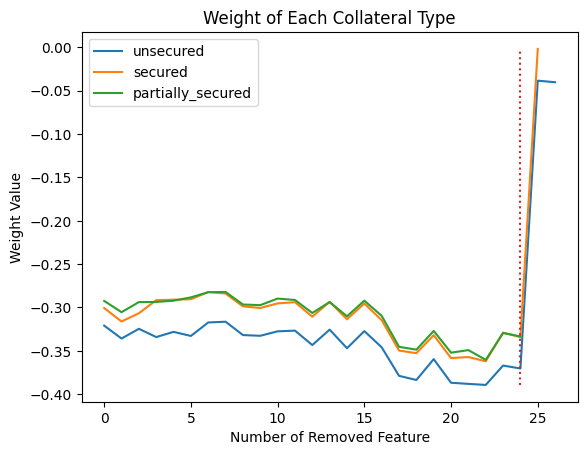
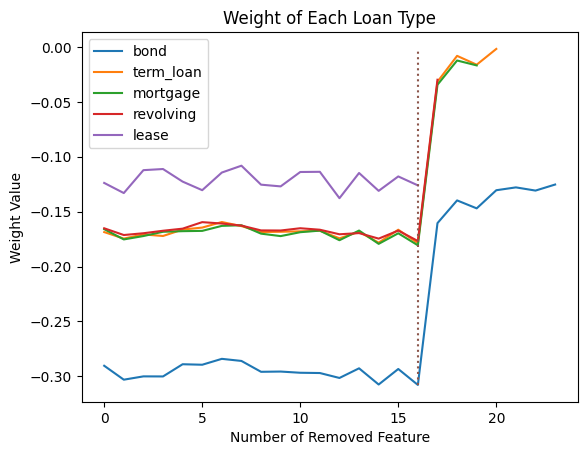
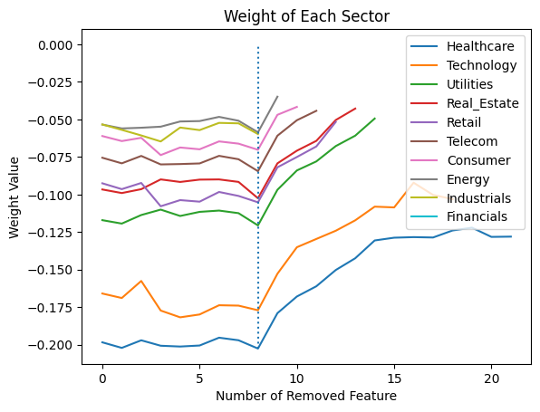
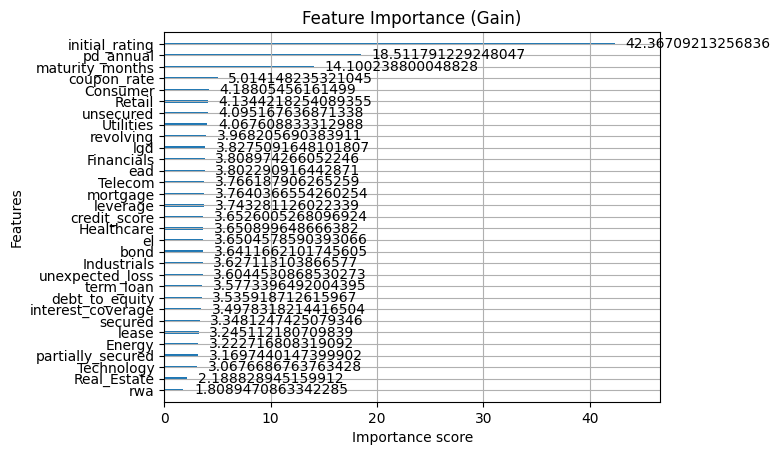
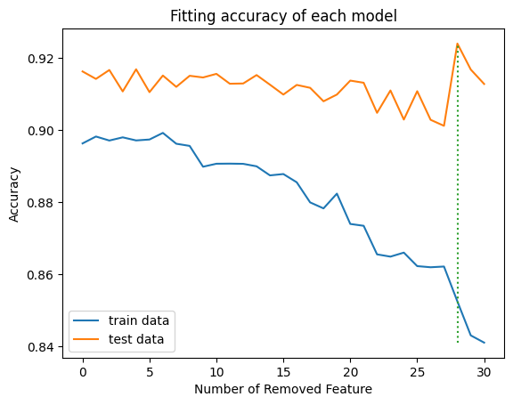
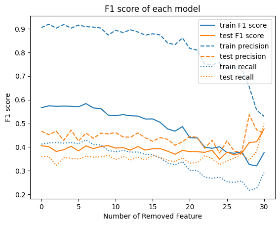

# Categorization Model for Loan Default Prediction

This project creates machine learning model for default prediction, using logistic regression and gradient boosted decision trees. Overfitting of these models were prevented by eliminate features based on feature priorities. Behavior of weight of each feature and intercept of each model during the elimination process also observed.  

## Motivation

This project came from [Kaggle](https://www.kaggle.com/datasets/sergionefedov/credit-risk-dataset-50k-loans-10-sectors). I aim to use data from file “loan_portfolio.csv” to create model to predict loan default, which is in column “defaulted”, using logistic regression or gradient boosted decision trees. 

Some input features are calculated from other features, namely *pd_annual*, *lgd*, *el*, *unexpected_loss*, and *rwa*, which came from feature engineering. These calculated input features may be more suitable for machine learning, or they may produce redundancy without contribute more to accuracy. In this project, I will try remove less important feature to see whether these engineered features worth keeping or they just introduce redundancy.

## Methodology

After download the dataset from Kaggle. All process is on **Python** package **Pandas**.
1.	Analyze type of input. I found that it has 31 input features
    -	*sector*, *collateral*, *loan_type* are categories that will be applied one-hot encoder afterward
    -	*maturity_months*, *initial_rating* are discrete, so they were scaled into interval 0-1 along with *credit_score*
2.	Out-of-time splitting with 70:30 ratio, then scale other input features into z-score using mean and standard deviation of the training data set.
    -	The train data is loan data that originated from January 2015 to March 2021
    -	The test data is loan data that originated from April 2021 to December 2023
3.	Train the models. The logistic regression was done using package **Scikit-Learn (sklearn)**, while gradient boosted decision trees were done using package **XGBoost**.
4.	Find feature importance and remove lesser important feature to evaluate whether the model is overfitted to the training data or not. The evaluation was done by accuracy of prediction from the training and testing data set.

## Results

### Logistic Regression

1. I use absolute of weight as feature Importance of the logistic regression. The results are as follows:

We found that input features that produced by one-hot encoder tend to have similar absolute weight. Such features are:
-	sector: Energy, Telecom, Consumer, Financials, Industrials, Healthcare, Technology, Utilities, Retail, Real_Estate
-	loan_type: term_loan, mortgage, revolving, bond, lease
-	collateral: secured, unsecured, partially_secured
We may consider this similarity as weight of group. In this case, collateral has more weight than sector and loan_type, which seem to mixed between each other.

2. By remove less important features, accuracy of prediction from train and test data sets are as follows:

The accuracy of train and test data are constant. Until the 23 input features were removed (at the green dotted line), accuracy of test data jumped up. At this point, the important features sorted by the most to the least are: *maturity_months* > *initial_rating* > *credit_score* > *pd_anual* > types of *collateral* (*unsecure* > *secure* > *partially_secured*). We see that *pd_anual*, which is engineered feature, survive for long, so it is good engineered feature.

The *maturity_months* is the most important feature because the longer of the loan, the risker it become. The other features namely *initial_rating*, *credit_score*, and *pd_annual* seem came from evaluation of each loan overall, which may already include other features. 

3. When we use F1 score instead of accuracy, the results are as follows:

F1 score is more preferable for imbalance data, which the defaulted loans are 16.43% on train data, and 7.98% on test data. F1 score began to fall when 22 input features were eliminated due to poor recall. This suggest we should include *bond* feature, which is whether the loan is bond or other type, because bond tend to not defaulted compared to other type of loans.  

4. Consider intercept of each model

The intercept is slowly decrease before the model gain more accuracy in test dataset, which is at the 23th feature elimination (the orange dotted line). At near the end, the intercept value fluctuated widely. Before this point, model accuracy was maintained by adjusted weight between each feature. This figure show that after this point, model accuracy was maintained by adjustment of intercept. We should not eliminate features until the intercept fluctuated widely, because important features included in intercept and no longer transparent in behavior. 

5. Jump in weights of one-hot encoded features

   1) Consider the features the produced by one-hot encoding on collateral. Weight of these features are as follows:

We see that partially secured is nearly as good as secured collateral, so these seem to be redundant. When the 24th feature was eliminated (at the red dotted line), which is *partially_secured*, weight of feature all the rest have high jump to compensated the eliminated feature. However, when the rest also get eliminated as well, such high jump no longer occurs. 

This high jump came from reduction of dimension. For example, let the feature *secured* represented as vector (1,0,0) *partially_secured* with vector (0,1,0) and *unsecured* with vector (0,0,1). Because of these features produced by one-hot encoder, vector (0,0,0) was never used. When the feature with the least absolute weight was eliminated, which is *partially_secured* in this case, the encoded vectors were changed. After elimination, *secured* was represented with vector (1,0), and *unsecured* with vector (0,1), while *partially_secured* take place of (0,0). Weights of the remained feature need to compensated for the eliminated one, and lead to high jump in weight. 

   2) This high jump also occurred on other features that produced by one-hot encoding as well. For *loan_type*, the jump happened at 16th feature elimination (at the red dotted line), which is *lease*.

   3) For *sector*, the jump happened at 8th feature elimination (at the blue dotted line), which is *Industrials*.

In this case, *Financials* has weight at very near 0, so its elimination does not have noticeable effect on other feature weights.

Note that such high jump in one-hot encoded features only occur once when a feature among its group were eliminated. Afterward, their weights seem to change according to certain trend without high jump. Furthermore, weight of most features did not have large jump like these. They seem to fluctuated and move in slow trend, similar to one-hot encoded feature before the high jump happened.

### Gradient boosted decision Trees

1. I use gain as feature Importance of the gradient boosted decision trees. The results are as follows:

We see that feature of importance may not have exact sequence as logistic regression, but overall sequence seems to agree with the logistic regression case.

2. By remove less important features, accuracy of prediction from train and test data sets are as follows:

Even though accuracy from the train data is decrease as more input features are eliminated from the gradient boosted decision trees model, it still maintain accuracy well on the test data set. Until the 28 input features are eliminated (at the green dotted line), the accuracy of testing data is jumped up instead of slow declined trend before. At this point, the important features sorted by the most to the least are: *initial_rating* > *pd_annual* > *maturity_months* > *coupon_rate*.

3. When we use F1 score instead of accuracy, the results are as follows:

F1 score of gradient boosted decision trees began to rise near the end. It seems to suggest that the most important feature, which is *initial_rating*, is the only feature we need. However, this may also large fluctuation as in intercept of the logistic regression model, because both accuracy and F1 score decrease more rapidly around the end of elimination. 

In both model types, logistic regression and gradient boosted decision trees, important features are *maturity_months*, *initial_rating*, and *pd_annual*, but with different priority. From logistic regression, next feature priority are *collateral* types, while gradient boosted decision trees were *coupon_rate*. 

### Compare Performance

Best case out-of-time performance of each model is as follows:

| Model	Accuracy | Precision | Recall | F1 score | 
| ---   | ---   | ---   | ---   | ---   |
| Logistic Regression at 22 | 0.9194 | 0.4932 | 0.3651 | 0.4196 |
| Gradient Boosted at 27 | 0.9011 | 0.3819 | 0.3525 | 0.3666 |

By accuracy alone, logistic regression is better model. However, precision in this case is undefined at 30, because there is not true positive and fault positive. Furthermore, when take imbalance into account which defaulted cases are minority of overall data, F1 score is more suitable. The F1 score shows that gradient boosted is better model. 

Note that model 22 of the logistic regression was chosen because it is the point just before recall and F1 score of test data decreased. For gradient boosted model, the model 27 was chosen because it is the last point before train F1 score began to decline sharply. Even though test F1 score kept rising past this point, the rise is likely unreliable fluctuation from the small number of defaulted cases in the test set, not genuine improvement.

## Limitation

I did not do hyperparameter tuning, such as varying fitting cost, or number of decision tree in gradient boosted. Classification threshold of both models is 0.5, which is default value. I also did not cross validate prediction between the models.

## Conclusion

We found that both logistic regression and gradient boosted decision trees are mostly agreed on which features contributed more on model accuracy, but may disagree on feature priorities. These important features are *maturity_months*, *initial_rating*, and *pd_annual*. The last one is an engineered feature. When change fitting score from accuracy into F1 score on out-of-time data, the results are mostly agreed, but different in which feature should still be remained. 

When we eliminate features based on importance priorities, weight of each feature and intercept of each logistic regression model change slowly. However, features that introduced by one-hot encoding can produce high jump when the least importance feature of the group was eliminate. Furthermore, when near top priority features were eliminated, it creates large fluctuation in model intercept. This may show regime that we should stop feature elimination.

## Author

I’m Surawut Pawutinan, and my nickname is Junior. This is my [LinkedIn](https://www.linkedin.com/in/surawut-paw-junior/), and my [GitHub](https://github.com/junior-surawutp).
